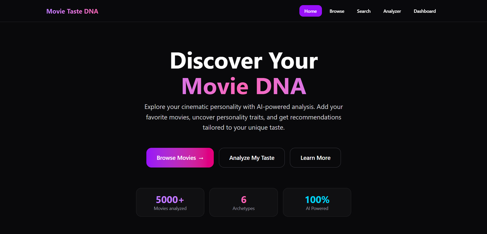
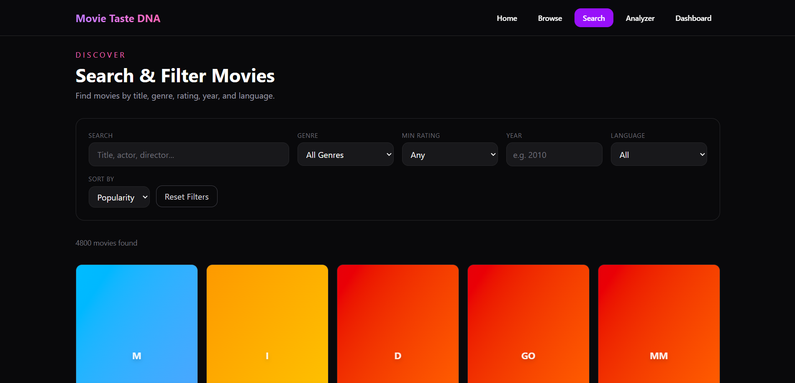
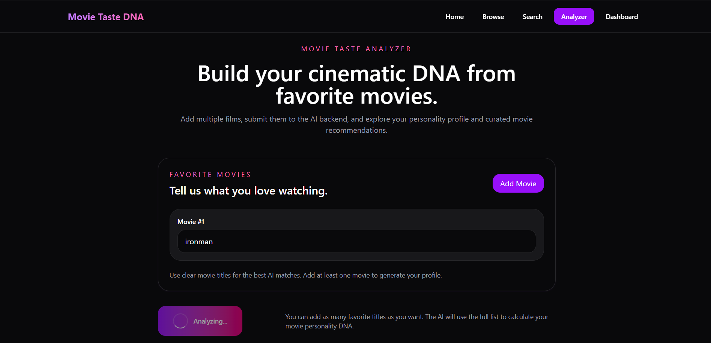
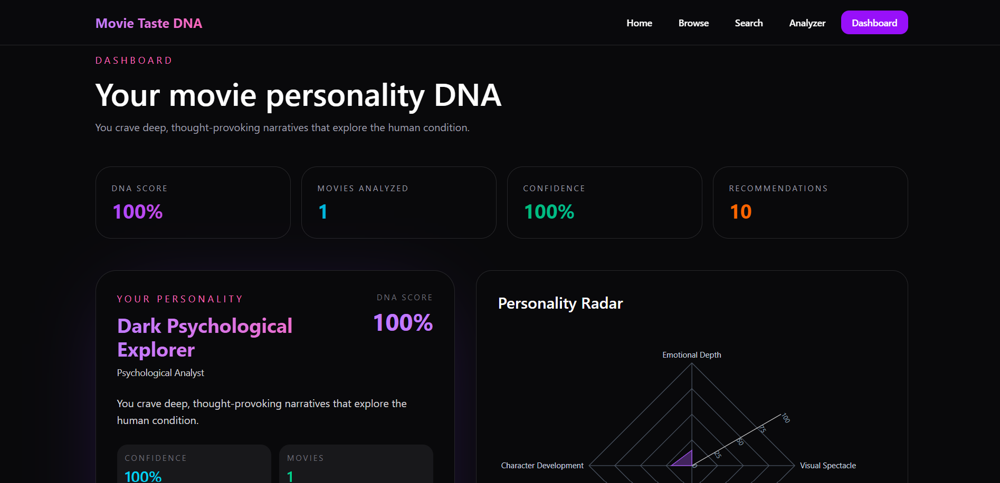

# 🎬 AI Movie Recommendation System

### Discover Your Movie Taste DNA with AI

An AI-powered web application that analyzes users' favorite movies to build a unique Movie Taste DNA, identify personality traits, and generate personalized movie recommendations using Machine Learning.

🌐 **Live Demo**

https://ai-movie-taste-dna.vercel.app

---

# ✨ Features

- AI-powered Movie Taste DNA
- Personalized Movie Recommendations
- Content-Based Recommendation Engine
- Movie Search & Filtering
- Favorite Movie Analyzer
- Interactive Dashboard
- Personality Radar Visualization
- REST API Backend
- Responsive UI
- Fast Recommendation Engine

---

# 🛠 Tech Stack

Frontend

- React
- Vite
- JavaScript

Backend

- FastAPI
- Python

Machine Learning

- Scikit-Learn
- Pandas
- NumPy

Deployment

- Vercel
- Render

---

# 📷 Screenshots

## Home



---

## Movie Search



---

## Taste Analyzer



---

## Dashboard



---

# 📂 Project Structure

```text
backend/
│
├── app/
│   ├── ml/
│   ├── routes/
│   ├── schemas/
│   ├── services/
│   ├── utils/
│   └── main.py
│
frontend/
│
├── src/
├── public/
└── package.json
```

---

# 🚀 Installation

### Backend

```bash
cd backend

pip install -r requirements.txt

uvicorn app.main:app --reload
```

### Frontend

```bash
cd frontend

npm install

npm run dev
```

---

# 🎯 Future Improvements

- Collaborative Filtering
- User Authentication
- Watchlist
- User Ratings
- TMDB Integration
- Recommendation History
- Cloud Deployment
- AI Explanation Engine

---

# 👨‍💻 Author

**Aradhya Agarwal**

B.Tech Electronics & Communication Engineering

NIT Jalandhar

GitHub

https://github.com/ARADHYA200